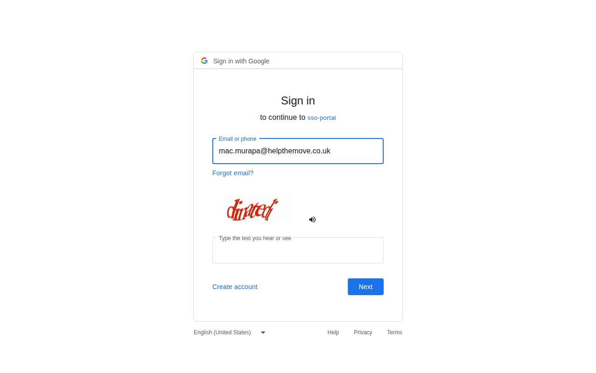

# HTM Clone Screenshot Test - HTM_Clone_Screenshot_002

## Test Objective
Sign in to the HTM Clone instance using Google OAuth with the `mac.murapa@helpthemove.co.uk` account and capture a screenshot of the authenticated homepage.

## Environment
- **System**: HTM Clone (HelpTheMove Admin Clone)
- **URL**: https://admin-clone.helpthemove.co.uk
- **Test Date**: 16/03/2026
- **Tester**: Automated Test Run
- **Test ID**: HTM_Clone_Screenshot_002
- **Tool**: Playwright CLI (Chromium) — Headless
- **Account Under Test**: mac.murapa@helpthemove.co.uk

## Test Steps

### Step 1: Launch Playwright (Headless)
- Launched Chromium in headless mode with proxy configured for full traffic routing (including Google OAuth)

### Step 2: Navigate to HTM Clone
- Navigated to `https://admin-clone.helpthemove.co.uk/`
- ✅ Login page loaded successfully, redirected to `/login?redirect=...`

### Step 3: Click "Sign in with Google"
- ✅ Button located and clicked
- ✅ Redirected to Google OAuth: `https://accounts.google.com/v3/signin/identifier`

### Step 4: Enter Google Account Email
- ✅ Email input field found (`input[type="email"]`)
- ✅ Email `mac.murapa@helpthemove.co.uk` entered into the field

### Step 5: Proceed Through Google Authentication
- ❌ **BLOCKED** — Google presented a CAPTCHA challenge (visual word verification) before allowing progression to the password step
- Automated headless browsers cannot solve CAPTCHAs — this is expected Google anti-automation behaviour

### Step 6: Capture Screenshot
- Screenshot captured of the current state (Google sign-in page with email entered and CAPTCHA displayed)

## Expected Result
The HTM Clone homepage/dashboard should load after successful Google OAuth authentication, displaying the authenticated admin interface for `mac.murapa@helpthemove.co.uk`.

## Actual Result
⚠️ **BLOCKED** — Test halted at Google CAPTCHA verification step:
- HTM Clone login page: ✅ Loaded
- "Sign in with Google" button: ✅ Clicked
- Google OAuth redirect: ✅ Reached `accounts.google.com`
- Email entered: ✅ `mac.murapa@helpthemove.co.uk` populated in field
- CAPTCHA challenge: ❌ Presented by Google — visual word CAPTCHA triggered for automated/headless browser session
- Homepage authenticated screenshot: ❌ Not captured — authentication incomplete

## Screenshot

## Blocker Analysis
Google detects headless Chromium sessions and presents CAPTCHA challenges to prevent automated login. This is a known anti-bot measure. Options to resolve:

1. **Stored Auth State** — Export Google session cookies from a logged-in browser and inject them into Playwright context using `storageState`
2. **Google OAuth Test Credentials** — Use a dedicated test service account via Google Cloud Console (Service Account + domain-wide delegation)
3. **Pre-authenticated Playwright Session** — Run `playwright codegen` interactively once to capture and save auth state, then reuse it

## Notes
- SSL certificate errors ignored (`ignoreHTTPSErrors: true`) as expected for clone environment
- Proxy correctly configured to route all traffic including `accounts.google.com` through the environment proxy
- The HTM Clone app itself is fully accessible and the OAuth initiation flow works correctly

## Test Status
⚠️ **BLOCKED** — Google CAPTCHA prevents headless automated login
