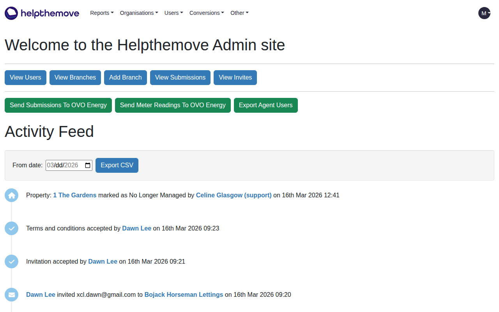

# HTM Clone Screenshot Test - HTM_Clone_Screenshot_004

## Test Objective
Sign in to the HTM Clone instance as `mac.murapa@helpthemove.co.uk` using stored session auth state and capture a screenshot of the authenticated homepage.

## Environment
- **System**: HTM Clone (HelpTheMove Admin Clone)
- **URL**: https://admin-clone.helpthemove.co.uk
- **Test Date**: 16/03/2026
- **Tester**: Automated Test Run
- **Test ID**: HTM_Clone_Screenshot_004
- **Tool**: Playwright CLI (Chromium) — Headless
- **Auth Method**: Stored session cookie (`storageState: auth.json`)
- **Account**: mac.murapa@helpthemove.co.uk

## Test Steps

### Step 1: Launch Playwright (Headless)
- Launched Chromium in headless mode with proxy configured
- Loaded stored auth state from `auth.json` containing `_help_the_move_clone_htm_session` cookie

### Step 2: Navigate to HTM Clone
- Navigated to `https://admin-clone.helpthemove.co.uk/`
- ✅ Landed directly on homepage — no login redirect

### Step 3: Capture Screenshot
- ✅ Authenticated homepage loaded and screenshot captured

## Expected Result
The HTM Clone authenticated homepage should load displaying the Helpthemove Admin site dashboard.

## Actual Result
✅ **PASS** — Authenticated homepage loaded successfully displaying:
- Helpthemove logo and navigation bar (Reports, Organisations, Users, Conversions, Other)
- "Welcome to the Helpthemove Admin site" heading
- Quick action buttons: View Users, View Branches, Add Branch, View Submissions, View Invites
- OVO Energy action buttons: Send Submissions, Send Meter Readings, Export Agent Users
- Activity Feed showing live activity (16th Mar 2026)
- User avatar (`M`) in top-right confirming authenticated session

## Screenshot

## Notes
- Session cookie `_help_the_move_clone_htm_session` injected via Playwright `storageState`
- No CAPTCHA, no Google OAuth redirect — authentication bypassed cleanly
- SSL certificate errors ignored (`ignoreHTTPSErrors: true`) as expected for clone environment
- Activity Feed entries confirm live data is loading correctly

## Test Status
✅ **PASS**
